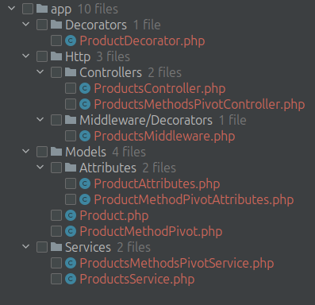

# php-crufd-wizard-generator

[](https://packagist.org/packages/macropay-solutions/php-crufd-wizard-generator)
[](https://packagist.org/packages/macropay-solutions/php-crufd-wizard-generator)
[](https://packagist.org/packages/macropay-solutions/php-crufd-wizard-generator)

Library for RetrieveQL [php-crufd-wizard](https://github.com/macropay-solutions/php-crufd-wizard) and for [php-crufd-wizard-decorator](https://github.com/macropay-solutions/php-crufd-wizard-decorator)

## Installation

1\. Run composer command:

``` composer require macropay-solutions/php-crufd-wizard-generator --dev ```


2\. Register the provider in bootstrap/app.php

```php
 if (InstalledVersions::isInstalled('macropay-solutions/php-kernel-dev')) {
    $app->register(\MacropaySolutions\CrufdWizardGenerator\CrufdWizardGeneratorServiceProvider::class);
}
```

## Usage

``` php run make:api-resource {resourceName} {--decorated} {--table=} {--connection=} {--composed} {--connectionAsModelFolder}```

This will create a template for **controller**, **service** and **model (with prepopulated columns from DB)** (optionally, with the **--decorated** flag it will create also a **decorator** and **middleware**) and will print instructions on what is left to be done manually.

If connection is not the default one, it can be specified in the command option.

If table is not the snake cased resourceName, then it can be specified in the table option. It is advised to have the table migrated in DB already.

Run just **php run make:api-resource** or **php run make:api-resource --decorated** for interactive mode that will try to guess the tableName and use default connectionName.

**--composed** flag will generate model and service for composed primary key 

Example:

```bash
php run make:api-resource products --decorated
```
```
Created Model: /var/www/html/project/app/Models/Product.php
Created ModelAttributes: /var/www/html/project/app/Models/Attributes/ProductAttributes.php
Created Service: /var/www/html/project/app/Services/ProductsService.php
Created Controller: /var/www/html/project/app/Http/Controllers/ProductsController.php
Created Decorator: /var/www/html/project/app/Decorators/ProductDecorator.php
Created Middleware: /var/www/html/project/app/Http/Middleware/Decorators/ProductsMiddleware.php
---------------------------------------------------------------------------------------------
TODO:
- Fill the Model's properties and relations,
- Fill the ModelAttributes' dock-block property types,
- Fill the ModelRelations' dock-block property-reads,
- Define validations and DbCrudMap in Controller,
- Fill the Decorator,
- Register Middleware decorator as route middleware,
- Use the middleware alias as middleware in your crud route definition for each method.
- Expose resource in DbCrudMap::MODEL_FQN_TO_CONTROLLER_MAP.
---------------------------------------------------------------------------------------------
Thank you for using php-crufd-wizard-generator
For more details see: https://github.com/macropay-solutions/php-crufd-wizard-generator
For full cruFd suite: https://php-crufd-wizard.com

```
---
```bash
php run make:api-resource products-methods-pivot --composed
```
```
Created Model: /var/www/html/project/app/Models/ProductMethodPivot.php
Created ModelAttributes: /var/www/html/project/app/Models/Attributes/ProductMethodPivotAttributes.php
Created Service: /var/www/html/project/app/Services/ProductsMethodsPivotService.php
Created Controller: /var/www/html/project/app/Http/Controllers/ProductsMethodsPivotController.php
---------------------------------------------------------------------------------------------
TODO:
- Fill the Model's properties and relations,
- Fill the ModelAttributes' dock-block property types,
- Fill the ModelRelations' dock-block property-reads,
- Replace composed primary keys id_1, id_2, ... in Model and Service,
- Define validations and DbCrudMap in Controller,
- Expose resource in DbCrudMap::MODEL_FQN_TO_CONTROLLER_MAP.
---------------------------------------------------------------------------------------------
Thank you for using php-crufd-wizard-generator
For more details see: https://github.com/macropay-solutions/php-crufd-wizard-generator
For full cruFd suite: https://php-crufd-wizard.com

```

Note.

If errors appear for creating folders (from docker container for example), create the folders manually or use this command in your project to give permissions to docker container for creating the files: ```sudo chown -R www-data:www-data app``` and run again the command.

The required folder structure is:



If **--connectionAsModelFolder** flag is used, **--connection=** will be \ucfirst and used as subfolder for Model and ModelAttributes.


If the command was already ran without the **--decorated** flag, it can be run again with it to generate the decorator and middleware.


## License

This package is licensed under the [license MIT](http://opensource.org/licenses/MIT).
